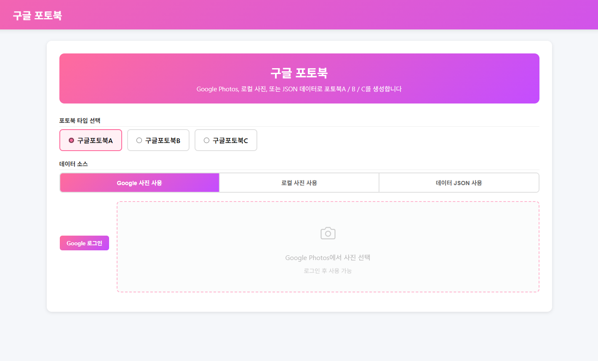

# socialBook - 구글 포토북 생성

구글 포토북 A / B / C 타입의 책을 생성하는 웹앱입니다.
Google Photos에서 사진을 불러오거나, JSON 테스트 데이터로 책을 만들 수 있습니다.



## 구조

```
├── index.html              # 메인 앱
├── app.js                  # 앱 로직 (UI, Google Photos 연동)
├── book-builder.js         # entries 변환, 파라미터 빌더
├── photobook-config.js     # 템플릿 매핑, 타입별 설정
├── style.css               # 스타일
├── sweetbook-sdk-core.js   # Sweetbook API SDK (core)
├── sweetbook-sdk-user.js   # Sweetbook API SDK (user)
├── config.example.js       # 설정 템플릿
├── config.js               # 실제 설정 (git 제외)
├── server.js               # 로컬 서버
├── assets/                 # 로컬 테스트 이미지
├── 구글포토북A/
│   ├── templates/          # A 템플릿 CSV, 그래픽 CSV
│   └── samples/            # A 샘플 JSON 데이터
├── 구글포토북B/
│   ├── templates/          # B 템플릿 CSV
│   └── samples/            # B 샘플 JSON 데이터
└── 구글포토북C/
    ├── templates/          # C 템플릿 CSV, 그래픽 CSV
    └── samples/            # C 샘플 JSON 데이터
```

## 설정

1. `config.example.js`를 `config.js`로 복사합니다:

```bash
cp config.example.js config.js
```

2. `config.js`에 API 키와 Google 인증 정보를 설정합니다:

```js
const APP_CONFIG = {
    environments: {
        live: { label: '운영', url: 'https://api.sweetbook.com/v1', apiKey: '운영 API Key' },
        sandbox: { label: '샌드박스', url: 'https://api-sandbox.sweetbook.com/v1', apiKey: '샌드박스 API Key' },
    },
    defaultEnv: 'sandbox',
    useCookie: false,
    googleClientId: 'xxxxx.apps.googleusercontent.com',  // Google OAuth Client ID
    googleApiKey: 'AIzaXXXXX',                           // Google API Key
};
```

- `googleClientId`와 `googleApiKey`는 [Google Cloud Console](https://console.cloud.google.com/)에서 발급받습니다.
- Google Photos API를 활성화해야 합니다.

## 실행

Google Photos 연동에 CORS 프록시가 필요하므로 내장 서버를 사용합니다:

```bash
node server.js
```

접속: http://localhost:8080

## 환경 (샌드박스 / 운영)

앱에서 **환경**을 선택할 수 있습니다:

- **샌드박스** (기본값): 테스트 환경. 생성된 책은 sandbox에만 존재하며, 운영 데이터에 영향 없음.
- **운영**: 실제 운영 환경. 운영 API Key가 필요합니다.

> **운영 환경에서는 실제 운영 데이터에 영향을 줍니다.**

## 테스트

### Google Photos 사용

1. 브라우저에서 http://localhost:8080 접속
2. API 모드가 **Test**인지 확인
3. 포토북 타입 선택 (A / B / C)
4. **Google 로그인** → 사진 불러오기
5. 사진 선택 후 **책 제작** 클릭

### JSON 테스트 데이터 사용 (Google 로그인 없이)

1. 포토북 타입 선택 (A / B / C)
2. 각 타입 폴더의 샘플 JSON 파일을 드래그앤드롭:
   - `구글포토북A/samples/구글포토북A.json` / `B` / `C` — picsum URL 기본 데이터
3. 사진 카드가 표시되면 **책 제작** 클릭

## 샘플 데이터

| 타입 | 샘플 | 설명 |
|------|------|------|
| 구글포토북A | [구글포토북A.json](구글포토북A/samples/구글포토북A.json) | 3개월 33장, dateA/dateB 혼합 |
| 구글포토북B | [구글포토북B.json](구글포토북B/samples/구글포토북B.json) | 3개월 30장, 단일 내지 |
| 구글포토북C | [구글포토북C.json](구글포토북C/samples/구글포토북C.json) | 7개월 15장, monthHeader+photo 조합 |

## 커스터마이징

이 데모를 자신의 서비스에 맞게 수정하려면:

| 파일 | 수정 내용 |
|------|----------|
| `photobook-config.js` | 템플릿 UID 변경, 포토북 타입별 필드 정의 |
| `book-builder.js` | 사진 배치 로직, entries 변환 수정 |
| `app.js` | UI 흐름, Google OAuth 설정, 사진 선택 로직 |
| `config.js` | API 키, Google 인증 정보, 서버 URL |

### Google Photos 대신 다른 사진 소스 사용

1. `app.js`에서 Google Photos API 호출 부분을 자신의 사진 API로 교체합니다.
2. 사진 데이터를 `{ url, width, height }` 형식으로 통일하면 `book-builder.js`는 그대로 사용할 수 있습니다.

## 주의사항

> ⚠️ **프로덕션 주의**: `server.js`의 CORS 설정은 `Access-Control-Allow-Origin: *`로 모든 origin을 허용합니다.
> 이는 로컬 개발용이며, 프로덕션 환경에서는 반드시 허용할 origin을 제한하세요.
